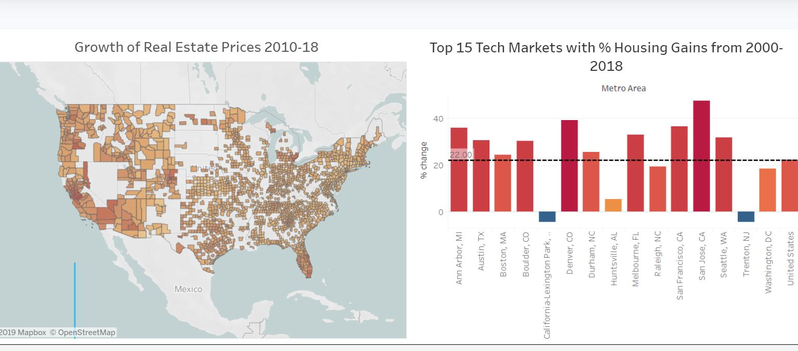
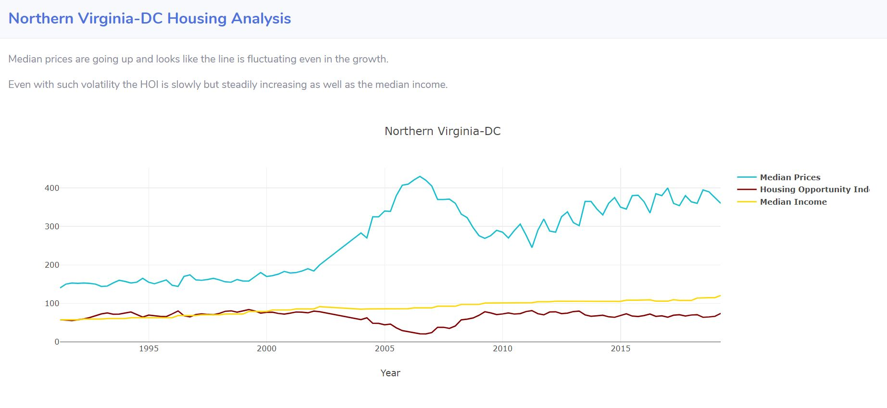

Project by: Nireesha Abbineni, Allyssa Calhoun, Emily Reynolds, Mrinmayee Kulkarni: August 24, 2019

Housing and the Technology Sector
As we prepare to welcome Amazon HQ2 to Washington D.C. and have already begun to get a glimpse of the real estate grab in Arlington, we were interested in exploring the connection between rising real estate prices and technology hubs. Below is an overview of the real estate market trends. In addition, we use machine learning models to provide insight on the interplay between the housing and technology sectors in tech hubs across the county. The factors we use to predict rises in housing prices provide insight on how Amazon and other companies might affect the real estate market in a technology sector-dependent area, like Arlington.

This full scope of this project has been deployed to Heroku @ https://housingmarket.herokuapp.com/tech_education_model

Catalog:

Source Code for the website: housingmarket folder

Source Code for the ML Models: MLModels folder

Platforms utilized: Tableau, Javascript, Python, HTML, Javascript-Plotly, and Machine Learning

A brief overview of the project: 

## Findings

#### Our premise assumes that technology companies attract high-skilled workers in the technology sector, and that these employees typically have more education and higher incomes. Our hypothesis is that technology companies, by attracting these employees in large numbers, may cause increases in housing prices due to both higher demand for housing and a higher willingness to pay.

<table border="0" class="table table-striped">

<thead>

<tr style="text-align: center;">

<th>Variable</th>

<th>Coefficient</th>

</tr>

</thead>

<tbody>

<tr>

<td>North Dakota</td>

<td>0.235118</td>

</tr>

<tr>

<td>District of Columbia</td>

<td>0.127124</td>

</tr>

<tr>

<td>Wyoming</td>

<td>0.108699</td>

</tr>

<tr>

<td>Hawaii</td>

<td>0.104170</td>

</tr>

<tr>

<td>Share of employees in the tech industry</td>

<td>0.093010</td>

</tr>

<tr>

<td>Years of education: moved population minus settled</td>

<td>0.091691</td>

</tr>

<tr>

<td>Virginia</td>

<td>0.071996</td>

</tr>

<tr>

<td>California</td>

<td>0.045889</td>

</tr>

<tr>

<td>Maryland</td>

<td>0.044081</td>

</tr>

</tbody>

</table>

#### Our model with an R2 score of 0.57 finds that the top four predictors of housing affordability for a county were whether the county was located in North Dakota, DC, Wyoming, or Hawaii, with coefficients of 0.24, 0.13,0.11, and 0.10, respectively . This was not a surprising result – the particulars of geographic constraints, local economies, and other factors specific to a region are significant influences in housing affordability. Our next two predictors were two variables we were particularly interested in - the share of employees in the tech industry, which predicted a 0.10 increase in the HPI, and the difference in year of education between the moved and settled populations, which predicted a 0.10 increase. This would imply that an increase in the concentration of workers in the technology sector and a more educated population of new residents both predict higher housing prices and therefore lower affordability.

